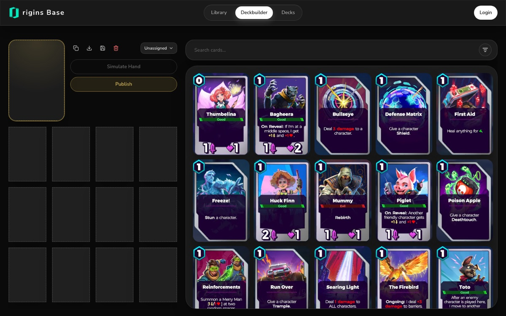

# Origins Base

Card library and deckbuilder for **Origins TCG**.

**[originsbase.com](https://originsbase.com)**



## Features

- **Library**: browse every card, token, item and location, with search and filters
- **Deckbuilder**: pick a legendary, fill the deck and tag it Aggro, Midrange, Combo or Control
- **Hand simulator**: draw a sample opening hand and re-roll the mulligan
- **Deck codes**: import and export decks as shareable codes
- **Published decks**: share decks publicly, with duplicate detection and a generated preview image for each deck
- **Accounts**: sign in with Clerk to save your decks

## Stack

Next.js 16 · React 19 · Convex · Clerk · Tailwind CSS 4 · shadcn/ui

## Run locally

```bash
npm install
npx convex dev    # creates a Convex project and writes NEXT_PUBLIC_CONVEX_URL
npm run dev
```

Set your Clerk keys (`NEXT_PUBLIC_CLERK_PUBLISHABLE_KEY`, `CLERK_SECRET_KEY`) in `.env.local`, and set `CLERK_JWT_ISSUER_DOMAIN` in your Convex deployment's environment (read by `convex/auth.config.ts`).

## Project layout

```
app/
  library/       cards and locations
  deckbuilder/   deck editor
  decks/         published decks
  dashboard/     signed-in account page
  api/og/deck/   deck share images
convex/          schema.ts, decks.ts
lib/             card data, deck codes, archetypes
```
